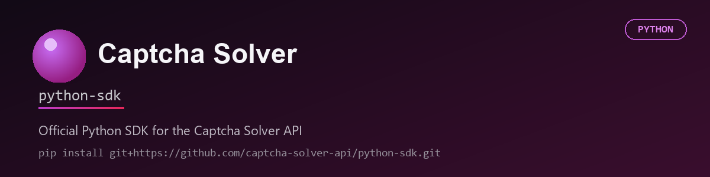

# Captcha Solver Python SDK



Official Python SDK for the Captcha Solver API. Solve reCAPTCHA v2/v3, Cloudflare Turnstile, GeeTest, Yandex SmartCaptcha, Tencent, and image/click captchas with a single method call -- sync or async.

Full API reference (all endpoints, error codes, captcha-type details): **https://captcha-solver.com/en/docs/captcha-types**

## Table of Contents

- [Installation](#installation)
- [Configuration](#configuration)
- [Quick Start](#quick-start)
- [Supported CAPTCHA Types](#supported-captcha-types)
- [Client Reference](#client-reference)
  - [CaptchaClient(...)](#captchaclient)
  - [solve(task, language_pool=None, timeout=None)](#solvetask-language_poolnone-timeoutnone)
  - [create_task(task, language_pool=None)](#create_tasktask-language_poolnone)
  - [get_task_result(task_id)](#get_task_resulttask_id)
  - [get_balance()](#get_balance)
- [Captcha Types](#captcha-types)
  - [reCAPTCHA v2](#recaptcha-v2)
  - [reCAPTCHA v2 Enterprise](#recaptcha-v2-enterprise)
  - [reCAPTCHA v3](#recaptcha-v3)
  - [Cloudflare Turnstile](#cloudflare-turnstile)
  - [Image to Text](#image-to-text)
  - [GeeTest (v3 & v4)](#geetest-v3--v4)
  - [Yandex SmartCaptcha](#yandex-smartcaptcha)
  - [Coordinates (click captcha)](#coordinates-click-captcha)
  - [Tencent](#tencent)
- [Advanced Usage](#advanced-usage)
  - [Check balance](#check-balance)
  - [Custom timeout and polling](#custom-timeout-and-polling)
  - [Worker language pool](#worker-language-pool)
  - [Async client](#async-client)
  - [Solving multiple captchas in parallel](#solving-multiple-captchas-in-parallel)
  - [Error handling](#error-handling)
- [Running the examples](#running-the-examples)
- [Requirements](#requirements)
- [API Documentation](#api-documentation)
- [License](#license)

## Installation

```bash
# pip install captcha-sdk

pip install git+https://github.com/captcha-solver-api/python-sdk.git
```

## Configuration

The client always takes the API key as an explicit argument -- it does not read
environment variables on its own. Read `CAPTCHA_API_KEY` yourself and pass it in:

```bash
export CAPTCHA_API_KEY=your_api_key
```

```python
import os
from captcha_sdk import CaptchaClient
client = CaptchaClient(os.getenv("CAPTCHA_API_KEY"))
```
Or just pass the key directly, without an environment variable:

```python
client = CaptchaClient("your_api_key")
```

## Quick Start

Solve a reCAPTCHA v2 in 4 lines.

```python
from captcha_sdk import CaptchaClient
from captcha_sdk.tasks import RecaptchaV2TaskProxyless
client = CaptchaClient("your_api_key")
task = RecaptchaV2TaskProxyless(
    websiteURL="https://example.com/login",
    websiteKey="YOUR_WEBSITE_KEY"
)
result = client.solve(task)
print(result["gRecaptchaResponse"])
```

## Supported CAPTCHA Types

| Type | Proxyless | With Proxy |
|---|---|---|
| reCAPTCHA v2 | ✅ | ✅ |
| reCAPTCHA v2 Enterprise | ✅ | ✅ |
| reCAPTCHA v3 | ✅ | ❌ |
| Cloudflare Turnstile | ✅ | ✅ |
| GeeTest v3 | ✅ | ✅ |
| GeeTest v4 | ✅ | ✅ |
| Image to Text | ✅ | ❌ |
| Yandex SmartCaptcha | ✅ | ✅ |
| Coordinates (click captcha) | ✅ | ❌ |
| Tencent | ✅ | ✅ |

## Client Reference

Every method below is available on both `CaptchaClient` (sync, `requests`-based) and
`AsyncCaptchaClient` (async, `httpx`-based, same names, `await`ed). Full docstrings
with the same content live in [captcha_sdk/client.py](captcha_sdk/client.py),
[captcha_sdk/async_client.py](captcha_sdk/async_client.py), and
[captcha_sdk/tasks.py](captcha_sdk/tasks.py) -- this section mirrors them for quick
reference without leaving the README.

### `CaptchaClient(...)`

Constructor.

| Parameter | Type | Default | Description |
|---|---|---|---|
| `client_key` | `str` | required | Your Captcha Solver API key. Raises `ValidationError` if empty. |
| `base_url` | `str` | `https://api.captcha-solver.com` | API base URL. Override only for self-hosted/staging deployments. |
| `timeout` | `int` | `120` | Default max seconds `solve()` waits for a solution before raising `TimeoutError`. Overridable per call. |
| `polling_interval` | `int` | `3` | Seconds between `getTaskResult` polls inside `solve()`. |
| `language_pool` | `Optional[str]` | `None` | Default worker pool (`"en"` or `"ru"`) applied to every call that doesn't pass its own `language_pool`. |

Both clients hold a reusable connection pool (`requests.Session` / `httpx.AsyncClient`)
for their lifetime instead of opening one per request. Close it when you're done --
`client.close()` (sync) or `await client.aclose()` (async) -- or use either client as
a context manager:

```python
with CaptchaClient("your_api_key") as client:
    result = client.solve(task)

async with AsyncCaptchaClient("your_api_key") as client:
    result = await client.solve(task)
```

### `solve(task, language_pool=None, timeout=None)`

The main entry point. Submits `task`, polls until it's solved, and returns the
solution -- wraps `create_task()` + `get_task_result()` so you don't poll by hand.

| Parameter | Type | Description |
|---|---|---|
| `task` | task object | One of the classes from `captcha_sdk.tasks` (see [Captcha Types](#captcha-types)). |
| `language_pool` | `Optional[str]` | Worker pool selector, `"en"` or `"ru"`. |
| `timeout` | `Optional[int]` | Overrides the client's default timeout for this call only, in seconds. Useful for captcha types that reliably take longer (e.g. classic reCAPTCHA v2, GeeTest, reCAPTCHA v3 with a high `minScore`). |

Returns the `solution` dict once `status` is `"ready"` -- its shape depends on
the task type (see [Captcha Types](#captcha-types)).
Raises `ApiError`, `TimeoutError`, or `NetworkError`.

### `create_task(task, language_pool=None)`

Submits `task` and returns its numeric task ID without waiting for a solution.
Same parameters as `solve()`. Use this instead of `solve()` only if you need to
manage polling yourself (e.g. checking on many tasks from a different process).
Raises `ApiError`, `NetworkError`.

### `get_task_result(task_id)`

Fetches the current status of a task created with `create_task()`. Always
returns a dict with a `status` key (`"processing"` or `"ready"`); when
`"ready"`, also has a `solution` dict. This is a single poll, not a wait --
call it repeatedly (as `solve()` does) until `status` is `"ready"`.
Raises `ApiError`, `NetworkError`.

### `get_balance()`

Returns the account's current balance (`float`) in the account's currency.
Raises `ApiError`, `NetworkError`.

## Captcha Types

Each section below covers one captcha type end-to-end: task parameters, the
`solution` shape, a runnable example, and a link to the full spec. Optional
fields left unset are omitted from the request. Every code block matches a
runnable file under [examples/sync](examples/sync) (and its
[examples/async](examples/async) counterpart) -- swap the placeholder
`websiteURL`/`websiteKey`/etc. for values from your own target page before
running. See [Running the examples](#running-the-examples) for details.

Types with a `*Task` counterpart (as opposed to `*TaskProxyless`) also accept
`proxyType` / `proxyAddress` / `proxyPort` / `proxyLogin` / `proxyPassword` to
solve through your own proxy instead of the service's IPs.

### reCAPTCHA v2

`RecaptchaV2TaskProxyless` (no proxy) / `RecaptchaV2Task` (with proxy).

| Parameter | Required | Description |
|---|---|---|
| `websiteURL` | yes | Full URL of the page where the captcha is located. |
| `websiteKey` | yes | Value of the widget's `data-sitekey` attribute. |
| `isInvisible` | no | `True` for invisible reCAPTCHA v2. |
| `recaptchaDataSValue` | no | The `data-s` value, found on Google Search/YouTube pages. |
| `apiDomain` | no | Non-default domain the widget's script is served from, if any. |
| `userAgent` | no | User-Agent to solve with. Recommended to match the agent submitting the token. |
| `cookies` | no | Session cookies to use while solving, if the page requires them. |

**Response:** `gRecaptchaResponse` -- submit as `g-recaptcha-response`. [Docs ↗](https://captcha-solver.com/en/docs/captcha-types#recaptcha-v2)

```python
from captcha_sdk import CaptchaClient
from captcha_sdk.tasks import RecaptchaV2TaskProxyless
client = CaptchaClient("your_api_key")
task = RecaptchaV2TaskProxyless(
    websiteURL="https://example.com/login",
    websiteKey="YOUR_WEBSITE_KEY"
)
result = client.solve(task)
print(result["gRecaptchaResponse"])
```

With proxy, use `RecaptchaV2Task` instead:

```python
task = RecaptchaV2Task(
    websiteURL="https://example.com/login",
    websiteKey="YOUR_WEBSITE_KEY",
    proxyType="http",
    proxyAddress="1.2.3.4",
    proxyPort=8080,
    proxyLogin="user",
    proxyPassword="password"
)
```

### reCAPTCHA v2 Enterprise

`RecaptchaV2EnterpriseTaskProxyless` / `RecaptchaV2EnterpriseTask`. Same fields
as reCAPTCHA v2, plus:

| Parameter | Required | Description |
|---|---|---|
| `enterprisePayload` | no | Extra parameters passed to `grecaptcha.enterprise.render` on the page, e.g. `{"s": "..."}`. |
| `apiDomain` | no | Defaults to `google.com`. |

**Response:** `gRecaptchaResponse`. [Docs ↗](https://captcha-solver.com/en/docs/captcha-types#recaptcha-v2-enterprise)

```python
from captcha_sdk import CaptchaClient
from captcha_sdk.tasks import RecaptchaV2EnterpriseTaskProxyless
client = CaptchaClient("your_api_key")
task = RecaptchaV2EnterpriseTaskProxyless(
    websiteURL="https://example.com/login",
    websiteKey="YOUR_WEBSITE_KEY"
)
result = client.solve(task)
print(result["gRecaptchaResponse"])
```

With proxy, use `RecaptchaV2EnterpriseTask` (same proxy fields as reCAPTCHA v2).

### reCAPTCHA v3

`RecaptchaV3TaskProxyless`. No proxy variant exists -- v3 is score-based and
invisible, so there's no widget/session to pin to a proxy IP.

| Parameter | Required | Description |
|---|---|---|
| `websiteURL` | yes | Full URL of the page where the captcha is located. |
| `websiteKey` | yes | Site key for the v3 widget. |
| `minScore` | yes | Minimum acceptable token score to return, e.g. `0.3`, `0.7`, `0.9`. |
| `pageAction` | no | The `action` parameter passed to `grecaptcha.execute()` on the page. |
| `isEnterprise` | no | `True` for reCAPTCHA v3 Enterprise. |
| `apiDomain` | no | Non-standard domain the widget's script is served from, if any. |

**Response:** `gRecaptchaResponse`. [Docs ↗](https://captcha-solver.com/en/docs/captcha-types#recaptcha-v3)

```python
from captcha_sdk import CaptchaClient
from captcha_sdk.tasks import RecaptchaV3TaskProxyless
client = CaptchaClient("your_api_key")
task = RecaptchaV3TaskProxyless(
    websiteURL="https://example.com/login",
    websiteKey="YOUR_WEBSITE_KEY",
    minScore=0.3,
    pageAction="homepage"
)
result = client.solve(task)
print(result["gRecaptchaResponse"])
```

### Cloudflare Turnstile

`TurnstileTaskProxyless` / `TurnstileTask`.

| Parameter | Required | Description |
|---|---|---|
| `websiteURL` | yes | Full URL of the page where the widget is located. |
| `websiteKey` | yes | Value of the widget's `data-sitekey` attribute. |
| `action` | no | Value of the widget's `data-action` attribute, if set. |
| `data` | no | Custom payload from the widget's `data-cdata` attribute, if set. |
| `pagedata` | no | Value of the `chlPageData` parameter, needed for some Cloudflare challenge pages beyond the basic widget. |
| `userAgent` | no | User-Agent to solve with -- the returned token is tied to it, submit with the same one. |

**Response:** `token` -- submit as `cf-turnstile-response`. [Docs ↗](https://captcha-solver.com/en/docs/captcha-types#cloudflare-turnstile)

```python
from captcha_sdk import CaptchaClient
from captcha_sdk.tasks import TurnstileTaskProxyless
client = CaptchaClient("your_api_key")
task = TurnstileTaskProxyless(
    websiteURL="https://example.com/login",
    websiteKey="YOUR_WEBSITE_KEY"
)
result = client.solve(task)
print(result["token"])
```

With proxy, use `TurnstileTask` (same proxy fields as reCAPTCHA v2).

### Image to Text

`ImageToTextTask`. No proxy variant -- the image is submitted directly, no
browser session involved.

| Parameter | Required | Description |
|---|---|---|
| `body` | yes | The captcha image, base64-encoded (no `data:image/...;base64,` prefix). |
| `phrase` | no | `True` if the answer is multiple words. |
| `case` | no | `True` if the answer is case-sensitive. |
| `numeric` | no | `0` unspecified, `1` digits only, `2` letters only, `3` any with digits, `4` any with letters. |
| `math` | no | `True` if the image contains a math expression to evaluate. |
| `minLength` / `maxLength` | no | Expected answer length bounds. |
| `comment` | no | Free-text hint for the worker. |
| `imgInstructions` | no | Optional supplementary instruction image, base64-encoded. |

**Response:** `text` -- the recognized text/answer. [Docs ↗](https://captcha-solver.com/en/docs/captcha-types#image-to-text)

```python
from captcha_sdk import CaptchaClient
from captcha_sdk.tasks import ImageToTextTask
import base64
with open("examples/assets/captcha-digits.png", "rb") as f:
    image_base64 = base64.b64encode(f.read()).decode("utf-8")
client = CaptchaClient("your_api_key")
task = ImageToTextTask(
    body=image_base64,
    numeric=1,
    minLength=4,
    maxLength=6
)
result = client.solve(task)
print(result["text"])
```

### GeeTest (v3 & v4)

`GeeTestTaskProxyless` / `GeeTestTask`. Set `version=4` for v4 (with
`initParameters["captcha_id"]`); v3 is the default and needs `gt`/`challenge` instead.

| Parameter | Required | Description |
|---|---|---|
| `websiteURL` | yes | Full URL of the page where the widget is located. |
| `version` | no | `3` (default) or `4`. |
| `gt` | v3 only | Public key of the GeeTest widget. |
| `challenge` | v3 only | Session-specific challenge value from the page -- must be freshly fetched for every request, it cannot be reused. |
| `initParameters` | v4 only | Extra parameters from the page's `initGeetest` call; for v4 must contain `captcha_id`. |
| `geetestApiServerSubdomain` | no | Custom GeeTest API subdomain, if the site uses one. |
| `userAgent` | no | User-Agent to solve with. |
| `risk_type` | no | Value of the `risk_type` parameter from the captcha-loading request, if present. Dynamic, single-use, and time-limited. |

**Response:** v3 -- `challenge`, `validate`, `seccode`. v4 -- `captcha_id`, `lot_number`, `pass_token`, `gen_time`, `captcha_output`.
Docs: [v3 ↗](https://captcha-solver.com/en/docs/captcha-types#geetest-v3), [v4 ↗](https://captcha-solver.com/en/docs/captcha-types#geetest-v4)

```python
from captcha_sdk import CaptchaClient
from captcha_sdk.tasks import GeeTestTaskProxyless
client = CaptchaClient("your_api_key")
task = GeeTestTaskProxyless(
    websiteURL="https://example.com/login",
    gt="f2ae6cadcf7886856696c46d84d109d1",
    challenge="12345678abc90123d45678e90123f45g6"  # dynamic -- fetch a fresh one per request
)
result = client.solve(task)
print(result["validate"])
print(result["seccode"])
```
`challenge` is session-specific and expires quickly, so it can't be hardcoded
into a static example -- see [examples/sync/geetest_v3.py](examples/sync/geetest_v3.py)
for where the fetch belongs in the flow.

```python
task = GeeTestTaskProxyless(
    websiteURL="https://example.com/login",
    version=4,
    initParameters={"captcha_id": "YOUR_CAPTCHA_ID"}
)
result = client.solve(task)
print(result["captcha_output"])
```

With proxy, use `GeeTestTask` (same proxy fields as reCAPTCHA v2).

### Yandex SmartCaptcha

`YandexSmartCaptchaTaskProxyless` / `YandexSmartCaptchaTask` -- token-based
challenge. For the image challenge instead, use `CoordinatesTask` with
`imgType="smart_captcha"` (see [Coordinates](#coordinates-click-captcha) below).

| Parameter | Required | Description |
|---|---|---|
| `websiteURL` | yes | Full URL of the page where the widget is located. |
| `websiteKey` | yes | The `sitekey` value from the page source or captcha iframe. |
| `userAgent` | no | User-Agent to solve with. |
| `cookies` | no | Session cookies to use while solving, if the page requires them. |

Proxy variant note: `proxyType` also accepts `"https"` for this captcha type
only (in addition to `http`/`socks4`/`socks5`).

**Response:** `token`. [Docs ↗](https://captcha-solver.com/en/docs/captcha-types#yandex-smartcaptcha)

```python
from captcha_sdk import CaptchaClient
from captcha_sdk.tasks import YandexSmartCaptchaTaskProxyless
client = CaptchaClient("your_api_key")
task = YandexSmartCaptchaTaskProxyless(
    websiteURL="https://example.com/login",
    websiteKey="YOUR_WEBSITE_KEY"
)
result = client.solve(task)
print(result["token"])
```

With proxy, use `YandexSmartCaptchaTask` (same proxy fields as reCAPTCHA v2,
plus the `https` option above).

### Coordinates (click captcha)

`CoordinatesTask`. Used both for generic "click on X" captchas and for Yandex
SmartCaptcha's image challenge. No proxy variant -- the image is submitted directly.

| Parameter | Required | Description |
|---|---|---|
| `body` | yes | The captcha image, base64-encoded. |
| `comment` | no (recommended) | Hint for the worker, e.g. `"click on the green apple"`. |
| `imgInstructions` | required for `imgType="smart_captcha"` | Instruction image, base64-encoded, showing what to click and in what order. |
| `minClicks` | no | Minimum number of clicks expected (default `1`). |
| `maxClicks` | no | Maximum number of clicks allowed. |
| `imgType` | no | `"smart_captcha"` to solve a Yandex SmartCaptcha image challenge instead of a generic click captcha. |

**Response:** `coordinates` -- a list of `{"x": int, "y": int}` pixel positions to click, in order. [Docs ↗](https://captcha-solver.com/en/docs/captcha-types#coordinates)

```python
from captcha_sdk import CaptchaClient
from captcha_sdk.tasks import CoordinatesTask
import base64
with open("examples/assets/fruit-click.png", "rb") as f:
    image_base64 = base64.b64encode(f.read()).decode("utf-8")
client = CaptchaClient("your_api_key")
task = CoordinatesTask(
    body=image_base64,
    comment="click on the green apple"
)
result = client.solve(task)
print(result["coordinates"])  # [{"x": 140, "y": 110}]
```
For the Yandex SmartCaptcha image challenge, see
[examples/sync/yandex_smartcaptcha_image.py](examples/sync/yandex_smartcaptcha_image.py)
(or [examples/async](examples/async/yandex_smartcaptcha_image.py)).

### Tencent

`TencentTaskProxyless` / `TencentTask`.

| Parameter | Required | Description |
|---|---|---|
| `websiteURL` | yes | Full URL of the page where the captcha is located. |
| `appId` | yes | Value of the `appId` parameter found in the page source. |
| `captchaScript` | no | URL of the Tencent captcha script, if the page uses a non-default one. |

**Response:** `appid`, `ret`, `ticket`, `randstr` -- pass all four into the page's Tencent captcha callback. [Docs ↗](https://captcha-solver.com/en/docs/captcha-types#tencent)

```python
from captcha_sdk import CaptchaClient
from captcha_sdk.tasks import TencentTaskProxyless
client = CaptchaClient("your_api_key")
task = TencentTaskProxyless(
    websiteURL="https://example.com/register",
    appId="YOUR_APP_ID"
)
result = client.solve(task)
print(result["ticket"])
```

With proxy, use `TencentTask` (same proxy fields as reCAPTCHA v2).

## Advanced Usage

### Check balance

```python
from captcha_sdk import CaptchaClient
client = CaptchaClient("your_api_key")
balance = client.get_balance()
print(f"Balance: {balance}")
```

### Custom timeout and polling

```python
client = CaptchaClient(
    client_key="your_api_key",
    timeout=180,
    polling_interval=5
)
```
A single `solve()` call can also override the client's default timeout, which is handy for
captcha types that reliably take longer to solve (e.g. classic reCAPTCHA v2) without changing
it for every other call:

```python
result = client.solve(task, timeout=300)
```

### Worker language pool

Set a default `language_pool` once at construction instead of passing it to every call:

```python
client = CaptchaClient(client_key="your_api_key", language_pool="en")
result = client.solve(task)  # uses the "en" pool
result = client.solve(task, language_pool="ru")  # overrides it just for this call
```

### Async client

`AsyncCaptchaClient` mirrors `CaptchaClient` method-for-method (`create_task`, `get_task_result`,
`get_balance`, `solve`, same constructor options), just `await`ed and built on `httpx` instead of
`requests`. It keeps one `httpx.AsyncClient` connection pool open for its whole lifetime, so
concurrent `solve()` calls (see below) and repeated polling share keep-alive connections instead
of each opening a new one:

```python
import asyncio
from captcha_sdk import AsyncCaptchaClient
from captcha_sdk.tasks import RecaptchaV2TaskProxyless

async def main():
    client = AsyncCaptchaClient("your_api_key")
    task = RecaptchaV2TaskProxyless(
        websiteURL="https://example.com/login",
        websiteKey="YOUR_WEBSITE_KEY"
    )
    result = await client.solve(task)
    print(result["gRecaptchaResponse"])

asyncio.run(main())
```
See [examples/async](examples/async) for every captcha type in async form.

### Solving multiple captchas in parallel

This is the main reason to reach for the async client -- run several `solve()` calls
concurrently instead of waiting for each one in turn:

```python
import asyncio
from captcha_sdk import AsyncCaptchaClient
from captcha_sdk.tasks import RecaptchaV2TaskProxyless, TurnstileTaskProxyless

async def solve_multiple():
    client = AsyncCaptchaClient("your_api_key")

    task1 = client.solve(RecaptchaV2TaskProxyless(websiteURL="https://site1.com", websiteKey="key1"))
    task2 = client.solve(TurnstileTaskProxyless(websiteURL="https://site2.com", websiteKey="key2"))

    results = await asyncio.gather(task1, task2, return_exceptions=True)
    return results

results = asyncio.run(solve_multiple())
```
This completes in roughly the time of the slowest single captcha, not the sum of all of them.

### Error handling

```python
from captcha_sdk import CaptchaClient, ApiError, TimeoutError, NetworkError, ValidationError
client = CaptchaClient("your_api_key")
try:
    result = client.solve(task)
except ValidationError as e:
    print(f"Invalid argument: {e}")
except ApiError as e:
    print(f"API error: {e.error_code} {e.error_description}")
except TimeoutError:
    print("Task timed out")
except NetworkError as e:
    print(f"Network error: {e}")
```

## Running the examples

- **Image/click captchas** (`image_to_text.py`, `coordinates.py`,
  `yandex_smartcaptcha_image.py`) run end-to-end with nothing but a valid
  `CAPTCHA_API_KEY` -- they read sample images bundled in
  [examples/assets](examples/assets), no target page needed.
- **Token captchas** (`recaptcha_v2.py`, `recaptcha_v2_enterprise.py`, `recaptcha_v3.py`,
  `turnstile.py`, `yandex_smartcaptcha.py`, `geetest_v4.py`, `tencent.py`) use
  placeholder values (`https://example.com/...`, `YOUR_WEBSITE_KEY`, `YOUR_APP_ID`,
  `YOUR_CAPTCHA_ID`) -- replace these with the real values from your own target
  page before running.
- **`geetest_v3.py`** additionally needs `challenge` fetched fresh for every
  request -- it's single-use and expires within seconds, so it can't be
  hardcoded into a static example. `"https://target-site.com/path/to/geetest/init"`
  is a placeholder; replace it with a request to your own target's equivalent
  endpoint (or wherever it exposes `gt`/`challenge`) -- see the script for where
  that fetch belongs in the flow.
- **Proxy variants** (`*Task` classes, as opposed to `*TaskProxyless`) use
  placeholder proxy credentials (`1.2.3.4` / `user` / `password`) in every example
  file -- proxies are a paid, account-specific resource, so there's nothing public
  to ship here. Swap in your own proxy details to run those blocks for real.

```bash
export CAPTCHA_API_KEY=your_api_key
python examples/sync/balance.py
python examples/sync/image_to_text.py
python examples/sync/coordinates.py
```

**Verified against the live API** during development, using real target pages and
real proxy credentials in place of the placeholders shown above: every captcha
type in this SDK -- proxyless and with proxy -- returned a real, correctly-shaped
solution when pointed at a genuine target. `geetest_v3.py`'s request shape was
likewise confirmed correct when given a real, freshly-fetched `gt`/`challenge`
pair.

## Requirements

- Python 3.9 or newer.
- Captcha Solver account with a valid API key.

## API Documentation

Full API reference: https://captcha-solver.com/en/docs/captcha-types

## License

This project is licensed under the MIT License. See [LICENSE.md](LICENSE.md) for details.
